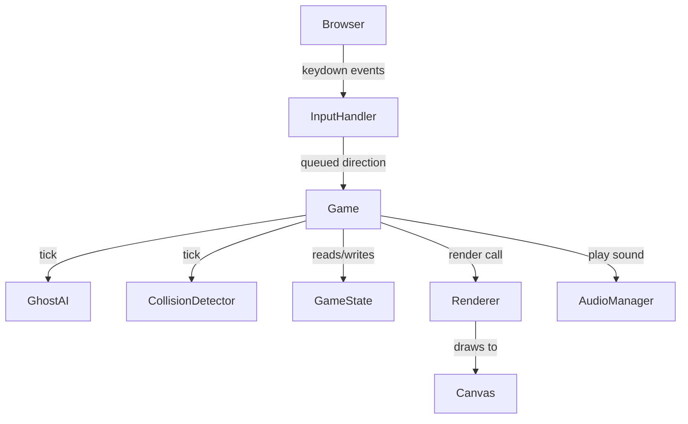

# Design Document: Pac-Man Game

## Overview

A browser-based Pac-Man game implemented in vanilla JavaScript using the HTML5 Canvas API. The game replicates the classic arcade experience: a player-controlled character navigates a tile-based maze, collecting dots and power pellets while avoiding four ghosts with distinct AI behaviors. The architecture is a game loop driven by `requestAnimationFrame`, with clear separation between game state, rendering, input handling, and AI logic.

The implementation targets modern browsers with no external runtime dependencies. Audio is handled via the Web Audio API with graceful degradation. The entire game runs client-side in a single HTML file with accompanying JS modules.

---

## Architecture

The game follows a **Model-View-Controller** pattern adapted for a real-time game loop:

- **Model** (`GameState`): Holds all mutable game data — maze grid, entity positions, scores, lives, level, game phase.
- **Controller** (`Game`): Owns the game loop, processes input, advances simulation, detects collisions, and drives state transitions.
- **View** (`Renderer`): Reads `GameState` and draws to the canvas each frame. Stateless with respect to game logic.



### Game Loop

```
requestAnimationFrame loop:
  1. Compute delta time
  2. Process queued input
  3. Update Pac-Man position (tile-boundary movement)
  4. Update ghost positions (GhostAI)
  5. Check collisions
  6. Check dot/pellet collection
  7. Check win/lose conditions
  8. Render frame
```

The loop runs only when the game is in the `PLAYING` state. All other states (START, PAUSED, GAME_OVER) render a static overlay.

---

## Components and Interfaces

### Game (Controller)

Central orchestrator. Owns the game loop and coordinates all subsystems.

```typescript
class Game {
  start(): void                  // transitions START → PLAYING
  pause(): void                  // toggles PLAYING ↔ PAUSED
  reset(): void                  // full reset to START state
  advanceLevel(): void           // increments level, resets maze/entities
  tick(deltaMs: number): void    // one simulation step
}
```

### GameState (Model)

Plain data container. No logic — only state.

```typescript
interface GameState {
  phase: 'START' | 'PLAYING' | 'PAUSED' | 'GAME_OVER'
  level: number
  score: number
  lives: number
  maze: MazeGrid
  pacman: PacManEntity
  ghosts: GhostEntity[]
  fruit: FruitEntity | null
  dotsEaten: number
  frightenedTimer: number        // ms remaining in frightened mode
  ghostEatenCombo: number        // ghosts eaten in current frightened activation
  scorePopups: ScorePopup[]
}
```

### Renderer (View)

Reads `GameState` and draws to a `<canvas>` element. Called once per frame.

```typescript
class Renderer {
  render(state: GameState): void
  // Internal draw methods:
  drawMaze(maze: MazeGrid): void
  drawPacMan(pacman: PacManEntity): void
  drawGhost(ghost: GhostEntity): void
  drawHUD(score: number, lives: number, level: number): void
  drawOverlay(phase: GameState['phase']): void
  drawScorePopups(popups: ScorePopup[]): void
}
```

### InputHandler

Listens to `keydown` events and maintains a direction queue.

```typescript
class InputHandler {
  getQueuedDirection(): Direction | null
  clearQueue(): void
  // Internally maps ArrowUp/Down/Left/Right → Direction enum
}
```

### GhostAI

Computes the next move for each ghost based on its mode and personality.

```typescript
class GhostAI {
  update(ghost: GhostEntity, state: GameState, deltaMs: number): void
  getChaseTarget(ghost: GhostEntity, state: GameState): Tile
  getScatterTarget(ghost: GhostEntity): Tile
  chooseNextTile(ghost: GhostEntity, target: Tile, maze: MazeGrid): Tile
}
```

Ghost personalities are encoded as strategy objects:

```typescript
interface GhostPersonality {
  name: 'Blinky' | 'Pinky' | 'Inky' | 'Clyde'
  color: string
  scatterCorner: Tile
  getChaseTarget(ghost: GhostEntity, state: GameState): Tile
}
```

### CollisionDetector

Checks entity positions each tick.

```typescript
class CollisionDetector {
  checkPacManGhost(state: GameState): CollisionResult
  checkPacManDot(state: GameState): DotCollectionResult
  checkPacManFruit(state: GameState): FruitCollectionResult
}
```

### AudioManager

Wraps the Web Audio API. Silently no-ops if audio is unavailable.

```typescript
class AudioManager {
  playChomp(): void
  playPowerPellet(): void
  playDeath(): void
  playEatGhost(): void
  // Internally uses AudioContext; catches and ignores errors
}
```

---

## Data Models

### Tile and Direction

```typescript
type Direction = 'UP' | 'DOWN' | 'LEFT' | 'RIGHT' | 'NONE'

interface Tile {
  col: number
  row: number
}
```

### MazeGrid

The maze is a 28×31 tile grid (matching the original Pac-Man layout). Each cell is a `CellType`.

```typescript
type CellType = 'WALL' | 'DOT' | 'POWER_PELLET' | 'EMPTY' | 'TUNNEL' | 'GHOST_HOUSE'

type MazeGrid = CellType[][]  // [row][col]
```

The maze layout is encoded as a static 2D array constant. Tunnel cells exist at row 14, columns 0 and 27. Wrapping is handled by the movement logic when a `TUNNEL` cell is exited.

### PacManEntity

```typescript
interface PacManEntity {
  tile: Tile                  // current grid tile
  pixelPos: { x: number, y: number }  // sub-tile position for smooth animation
  direction: Direction        // current movement direction
  nextDirection: Direction    // queued direction from input
  mouthAngle: number          // 0–45 degrees for mouth animation
  mouthOpening: boolean       // true = opening, false = closing
  speed: number               // tiles per second
}
```

### GhostEntity

```typescript
type GhostMode = 'CHASE' | 'SCATTER' | 'FRIGHTENED' | 'EATEN' | 'HOUSE'

interface GhostEntity {
  name: 'Blinky' | 'Pinky' | 'Inky' | 'Clyde'
  tile: Tile
  pixelPos: { x: number, y: number }
  direction: Direction
  mode: GhostMode
  speed: number               // tiles per second (reduced in FRIGHTENED)
  frightenedFlashing: boolean // true when frightened timer < 2s
}
```

### FruitEntity

```typescript
interface FruitEntity {
  tile: Tile
  points: number              // varies by level (100–5000)
  timeRemaining: number       // ms until despawn (9000ms max)
}
```

### ScorePopup

```typescript
interface ScorePopup {
  tile: Tile
  value: number
  timeRemaining: number       // ms to display (typically 1000ms)
}
```

### Level Configuration

Ghost speed, frightened duration, and scatter/chase timings are driven by a level config table:

```typescript
interface LevelConfig {
  ghostSpeed: number          // tiles/sec base speed
  frightenedDuration: number  // ms (min 1000)
  frightenedSpeed: number     // tiles/sec during frightened
  chaseScatterCycles: ChaseScatterCycle[]
}

interface ChaseScatterCycle {
  scatterDuration: number     // ms
  chaseDuration: number       // ms
}

const LEVEL_CONFIGS: LevelConfig[] = [
  // Level 1: ghostSpeed=0.75, frightenedDuration=7000, ...
  // Level 2+: incrementally faster, shorter frightened
]
```

### Ghost Chase/Scatter Timer

The game maintains a `modeTimer` that counts down through the `chaseScatterCycles` array for the current level. When a cycle expires, the next cycle begins. After all cycles, ghosts remain in Chase mode permanently.

---

## Correctness Properties

*A property is a characteristic or behavior that should hold true across all valid executions of a system — essentially, a formal statement about what the system should do. Properties serve as the bridge between human-readable specifications and machine-verifiable correctness guarantees.*


### Property 1: Tunnel wrapping is symmetric

*For any* entity (Pac-Man or ghost) that exits the left tunnel edge, it should appear at the right tunnel entrance at the same row, and vice versa — the exit position is always the opposite tunnel entrance.

**Validates: Requirements 1.3, 2.4**

---

### Property 2: Passable direction causes movement

*For any* Pac-Man position and any direction that is not blocked by a wall, queuing that direction and ticking the game should result in Pac-Man's tile changing in that direction.

**Validates: Requirements 2.2**

---

### Property 3: Blocked direction preserves current movement

*For any* Pac-Man position where the queued direction is blocked by a wall, ticking the game should result in Pac-Man continuing in its last valid direction (or staying still if also blocked).

**Validates: Requirements 2.3**

---

### Property 4: Collectible removal and score increment

*For any* maze state containing a dot or power pellet, when Pac-Man moves to that tile, the collectible is removed from the maze and the score increases by the correct amount (10 for dot, 50 for power pellet).

**Validates: Requirements 3.1, 3.2**

---

### Property 5: Power pellet triggers frightened mode on all ghosts

*For any* game state, when Pac-Man collects a power pellet, every ghost's mode should be set to FRIGHTENED and the frightened timer should be set to the level's configured duration.

**Validates: Requirements 3.3**

---

### Property 6: Ghost speed matches level configuration

*For any* level number, each ghost's base speed should equal the value specified in the level config table for that level.

**Validates: Requirements 4.1**

---

### Property 7: Chase/scatter mode alternates on timer

*For any* game state in normal mode, after the current scatter or chase duration elapses, each ghost's mode should switch to the next mode in the cycle sequence.

**Validates: Requirements 4.2**

---

### Property 8: Ghost chase targets are correct

*For any* Pac-Man position and direction, and any Blinky position:
- Blinky's chase target equals Pac-Man's current tile
- Pinky's chase target equals the tile 4 cells ahead of Pac-Man's direction
- Inky's chase target equals the tile computed by doubling the vector from Blinky to the tile 2 ahead of Pac-Man
- Clyde's chase target equals Pac-Man's tile when distance > 8, or Clyde's scatter corner when distance ≤ 8

**Validates: Requirements 4.3, 4.4, 4.5, 4.6**

---

### Property 9: Scatter mode targets designated corners

*For any* ghost in SCATTER mode, the ghost's pathfinding target should be its designated scatter corner tile.

**Validates: Requirements 4.7**

---

### Property 10: Frightened ghosts move at reduced speed

*For any* ghost in FRIGHTENED mode, its speed should be strictly less than its normal chase/scatter speed for the same level.

**Validates: Requirements 4.8**

---

### Property 11: Normal ghost collision decrements lives

*For any* game state where Pac-Man shares a tile with a ghost not in FRIGHTENED or EATEN mode, the life count should decrease by 1 and all entities should reset to their starting positions.

**Validates: Requirements 5.1**

---

### Property 12: Frightened ghost collision awards escalating points

*For any* sequence of n ghosts eaten within a single frightened activation (n = 1..4), the points awarded for the nth ghost should equal 200 × 2^(n−1), and the ghost's mode should become EATEN.

**Validates: Requirements 5.2, 6.1, 6.2**

---

### Property 13: Level advance resets maze and entities to starting state

*For any* game state that triggers level advancement, after the advance: the maze should contain all original dots and power pellets, Pac-Man's tile should equal its starting tile, and every ghost's tile should equal its starting tile.

**Validates: Requirements 7.1, 7.4**

---

### Property 14: Ghost speed is monotonically non-decreasing across levels

*For any* two consecutive levels n and n+1, the ghost base speed at level n+1 should be greater than or equal to the ghost base speed at level n.

**Validates: Requirements 7.2**

---

### Property 15: Frightened duration is monotonically non-increasing with a floor

*For any* two consecutive levels n and n+1, the frightened duration at level n+1 should be less than or equal to the frightened duration at level n, and always greater than or equal to 1000ms.

**Validates: Requirements 7.3**

---

### Property 16: Pause toggle is an involution

*For any* game in PLAYING state, pressing Escape should transition to PAUSED; pressing Escape again should return to PLAYING — the double application is the identity.

**Validates: Requirements 8.3**

---

### Property 17: Paused state freezes all entity positions

*For any* game in PAUSED state, ticking the game loop should not change the tile or pixel position of Pac-Man or any ghost.

**Validates: Requirements 8.4**

---

### Property 18: Audio failure does not affect game state

*For any* game state, if the AudioManager throws an error on any sound method, the game state (score, lives, positions, phase) should remain unchanged.

**Validates: Requirements 9.5**

---

### Property 19: Fruit collection removes fruit and adds correct points

*For any* game state containing a fruit item, when Pac-Man moves to the fruit's tile, the fruit should be removed (set to null) and the score should increase by the fruit's point value.

**Validates: Requirements 10.3**

---

## Error Handling

### Movement Errors
- If a requested direction would move Pac-Man out of maze bounds (non-tunnel), the move is silently ignored and the current direction is maintained.
- Tile lookups always clamp to valid grid indices to prevent array out-of-bounds.

### Ghost AI Errors
- If a ghost's pathfinding produces no valid next tile (e.g., completely surrounded by walls — impossible in the standard maze but guarded), the ghost stays in place for that tick.
- Ghost mode transitions that arrive out of order (e.g., EATEN → FRIGHTENED) are ignored; the EATEN state takes priority until the ghost reaches the house.

### Audio Errors
- All `AudioContext` and `AudioBufferSourceNode` operations are wrapped in try/catch.
- If `AudioContext` creation fails (e.g., browser policy blocks it), `AudioManager` sets an internal `enabled = false` flag and all subsequent calls are no-ops.
- No error is surfaced to the player.

### Level Config Bounds
- If a level number exceeds the length of `LEVEL_CONFIGS`, the last entry is used (clamped), preventing undefined access.

### Canvas Unavailability
- On initialization, if `canvas.getContext('2d')` returns null, the game displays a static error message in the DOM and halts.

---

## Testing Strategy

### Dual Testing Approach

Both unit tests and property-based tests are required. They are complementary:
- **Unit tests** verify specific examples, edge cases, and integration points.
- **Property tests** verify universal correctness across randomized inputs.

### Property-Based Testing

**Library**: [fast-check](https://github.com/dubzzz/fast-check) (JavaScript/TypeScript)

Each correctness property from this document must be implemented as a single property-based test using `fc.assert(fc.property(...))`. Tests must run a minimum of **100 iterations** each.

Each test must include a comment tag in the format:
```
// Feature: pacman-game, Property N: <property_text>
```

**Property test coverage:**

| Property | Test Description |
|---|---|
| P1 | Generate random tunnel-edge positions; verify wrapping lands at opposite entrance |
| P2 | Generate random open tiles and passable directions; verify tile changes correctly |
| P3 | Generate random positions with blocked queued direction; verify current direction maintained |
| P4 | Generate random maze states with collectibles; verify removal and score delta |
| P5 | Generate random game states; collect power pellet; verify all ghosts FRIGHTENED |
| P6 | Generate random level numbers; verify ghost speed matches config |
| P7 | Generate random mode timers; advance time past duration; verify mode switches |
| P8 | Generate random Pac-Man/Blinky positions and directions; verify each ghost's target formula |
| P9 | Generate random ghost states in SCATTER; verify target is scatter corner |
| P10 | Generate random levels; verify frightened speed < normal speed |
| P11 | Generate random states with Pac-Man on non-frightened ghost tile; verify life decrement |
| P12 | Generate combo sequences 1–4; verify score formula 200×2^(n−1) |
| P13 | Generate random pre-advance states; advance level; verify maze and positions reset |
| P14 | Generate random consecutive level pairs; verify speed is non-decreasing |
| P15 | Generate random consecutive level pairs; verify frightened duration is non-increasing and ≥ 1000ms |
| P16 | Generate random PLAYING states; toggle pause twice; verify returns to PLAYING |
| P17 | Generate random PAUSED states; tick; verify no position changes |
| P18 | Generate random game states; inject throwing AudioManager; verify state unchanged |
| P19 | Generate random fruit states; move Pac-Man to fruit tile; verify removal and score delta |

### Unit Test Coverage

Unit tests (using [Jest](https://jestjs.io/) or [Vitest](https://vitest.dev/)) should cover:

- **Maze initialization**: Correct cell types at known positions (e.g., tunnel cells at row 14 col 0/27, ghost house cells)
- **Input handler**: Each arrow key maps to the correct `Direction` enum value
- **State transitions**: START → PLAYING on keypress; PLAYING → GAME_OVER when lives reach 0
- **Fruit spawning**: `dotsEaten === 70` spawns fruit; `dotsEaten === 170` spawns second fruit
- **Fruit despawn**: Fruit with `timeRemaining <= 0` is removed
- **Score popup creation**: Eating a ghost creates a `ScorePopup` at the ghost's tile
- **Level clear**: Zero remaining dots/pellets triggers `advanceLevel()`
- **Audio mocking**: Each game event calls the correct `AudioManager` method (mock the manager)
- **Canvas unavailability**: Null canvas context shows error message and halts loop

### Test File Structure

```
src/
  __tests__/
    maze.test.ts          // maze initialization, cell types, tunnel positions
    movement.test.ts      // Pac-Man movement, wall collision, tunnel wrapping
    ghostAI.test.ts       // targeting formulas, mode transitions, speed
    collision.test.ts     // ghost/dot/fruit collision outcomes
    scoring.test.ts       // dot/pellet/ghost/fruit score values, combo formula
    gameState.test.ts     // phase transitions, level advance, reset
    audio.test.ts         // audio event dispatch, graceful degradation
    properties/
      movement.prop.ts    // P1, P2, P3
      collection.prop.ts  // P4, P5
      ghostAI.prop.ts     // P6, P7, P8, P9, P10
      collision.prop.ts   // P11, P12
      levelProgression.prop.ts  // P13, P14, P15
      gameState.prop.ts   // P16, P17
      audio.prop.ts       // P18
      fruit.prop.ts       // P19
```
